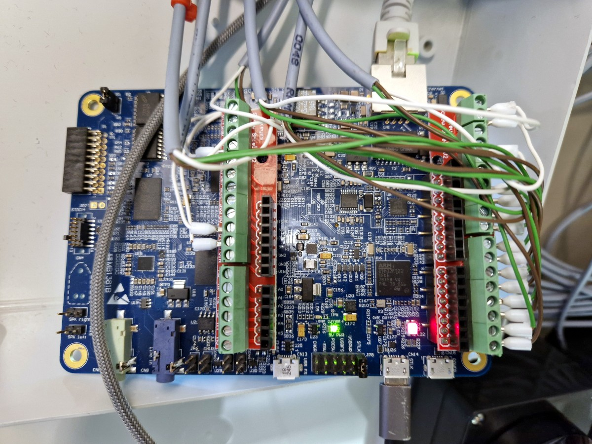
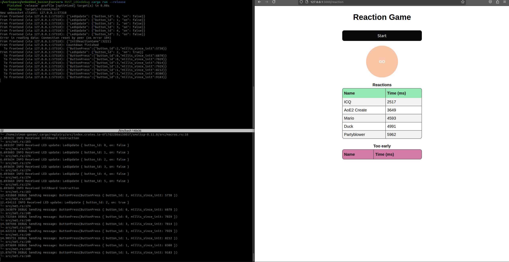
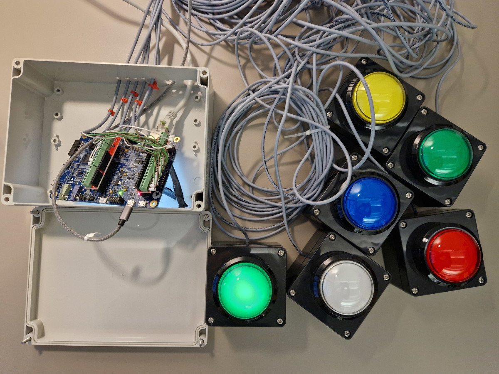
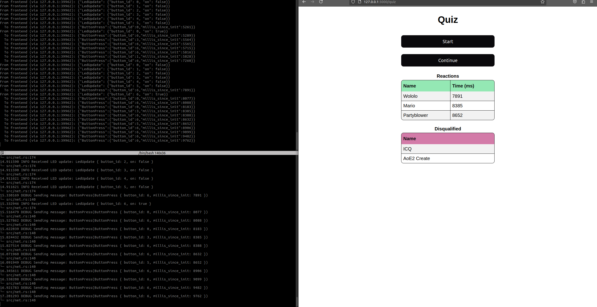

# embedded_buzzer

Quiz buzzer system with the [STM32H745XI discovery board][board].
Inspired by an [ESR Labs LabDays (hackathon) project][labdays_proj].



During the hackathon, we built a buzzer system.
Six buzzers are connected to a STM32 board.
The board is further connected via ethernet to a local laptop.
A server runs on the laptop, providing a frontend for the game
and communicating with the board.

The frontend instructs the board to start a game
and sends commands to set the LEDs high or low.
The board listens for button presses (via rising/falling flanks depending on the button type),
debounces the presses and forwards them to the server.
The server evaluates the game logic.

There are two play modes implemented: Reaction and quiz.
In the reaction game, players have to press the button after a random countdown.
In the frontend, players only see when the countdown has passed, but not how long it still is.
If a player presses to fast, it will also be noted.
The buzzer of the fastest player glows after a round.
Sounds a replayed, so players / teams can identify who just pressed their button
(for license reasons, the sounds are not included in the repo).
In the quiz mode, player reaction times are also shown.
The fastest player / team can give an answer, and if it was wrong,
the game can continue with the fastest player disqualified by clicking on `Continue`.

This was a nice pet project using the following things:

- Programming an embedded board with `#![no_std]` Rust
- Network communication from the embedded board to the laptop
- Game logic synchronization between the server and the board
- Websockets to communicate with the frontend
- Proxying between the board and the frontend







## Setup

Configure your local network interface to have a static IP in the same subnet
as the board (`192.168.100.1/24`):

```
2: eth0: <BROADCAST,MULTICAST,UP,LOWER_UP> mtu 1500 qdisc mq state UP group default qlen 1000
    ...
    inet 192.168.100.1/24 brd 192.168.100.255 scope global noprefixroute enp11s0
       valid_lft forever preferred_lft forever
```

Allow traffic on port `8000` in your firewall:

```bash
sudo ufw status
Status: active

To                         Action      From
--                         ------      ----
...
8000                       ALLOW       Anywhere
...
```

Set the right `udev` rules for your device. You can get the parameters from
`dmesg`. Example:

```
# /etc/udev/rules.d/70-st-link.rules

# STM32H745 MCU
ATTRS{idVendor}=="0483", ATTRS{idProduct}=="374e", TAG+="uaccess"
```

Install `probe-rs-cli`

```bash
cargo install probe-rs-cli
```

## Run

```
# Server
cd server
cargo run --release

# Board
cd buzzer_board
cargo run --bin buzzer
```

The two frontends are available at

- http://127.0.0.1:3000/reaction
- http://127.0.0.1:3000/quiz

[board]: https://www.st.com/en/evaluation-tools/stm32h745i-disco.html
[labdays_proj]: https://github.com/sameernegi17/QuizBuzzerSystem
